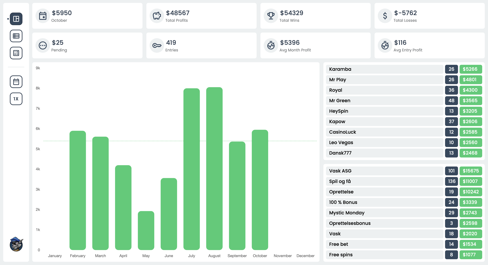
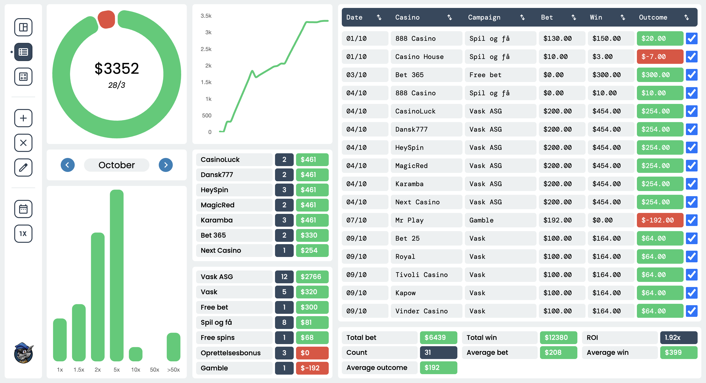

# Casino Tracker

**Casino Tracker** is a personal logging and tracking application I developed to manage my entries across various bookmaker sites. Designed with a clean, modern interface, the dashboard features a flat material color scheme and is neatly divided into sections for easy navigation.

## Key Features:
- **Responsive Design**: Optimized for both desktop and mobile use, with a focus on a seamless experience on devices with a max-width of 360px.
- **Cloud Storage**: All entries are securely stored in Google Firebase, allowing for cross-device access and real-time updates. The application itself is also hosted on Firebase for smooth performance and easy access anywhere.
- **Simple JSON Structure**: Entries are saved as JSON objects, making it straightforward to generate graphs, statistics, and insights from the data.
- **Streamlined Data Visualization**: The dashboard includes powerful and intuitive graphing features to help visualize trends and track activity effortlessly.

## Screenshots:

### Dashboard  

### Entries  

This project showcases my passion for building functional, minimalist dashboards that emphasize ease of use and scalability.